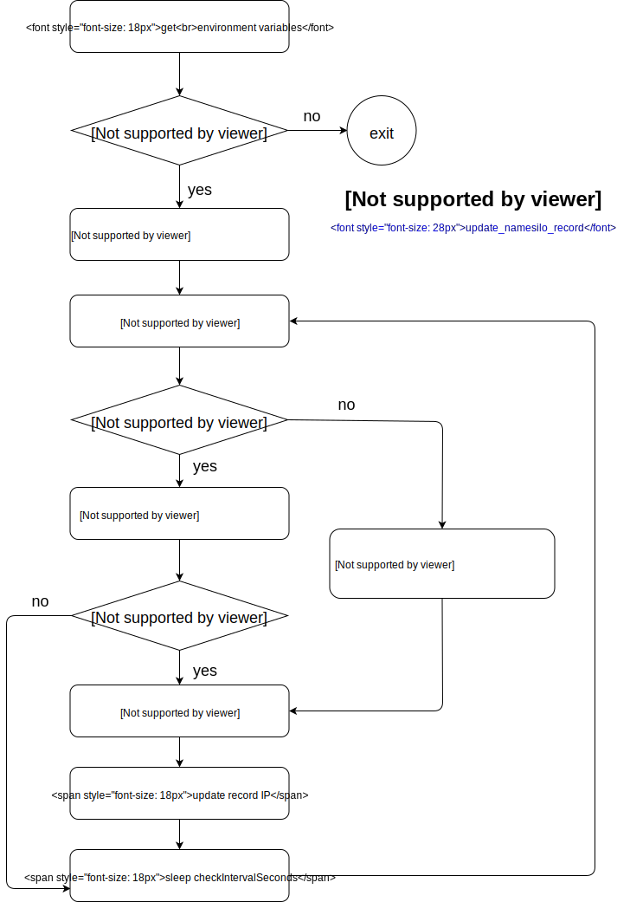

# Update IP address for namesilo record

Update the ip address for a record in [namesilo](https://www.namesilo.com), like `myhome-dynamic-ip.example.com`. what is the purpose of that, well, because of:

1. I don't have a dedicated IP address in my home
1. I don't like those DDNS services, terms of service looks like traps
1. I do have a domain name registered on [namesilo](https://www.namesilo.com)

with a local public IP fetched from free service, requests to two api:

* [dnsListRecords](https://www.namesilo.com/api_reference.php#dnsListRecords)
* [dnsUpdateRecord](https://www.namesilo.com/api_reference.php#dnsUpdateRecord)

All it does is just:

## prerequisite for using

I'm gonna use `myhome-dynamic-ip.example.com` as the **example**, so just replace them with your own values.

- **Your API Key**: get it from [namesilo API manager page](https://www.namesilo.com/account/api-manager)
- **Your domain name**: the `example.com` part in **example**
- **Your record name**: the `myhome-dynamic-ip` part in **example**

## docker usage

`docker run --name update-ns-ip --env API_KEY=your-api-key --env DOMAIN=your-domain.com --env RECORD_NAME=your-record-name windsting999/update-namesilo-record`

Don't forget to replace those environment variable(i.e. `your-api-key`, `your-domain.com`, `your-record-name`) to your own values, read the **prerequisite for using** part for getting them.

With command above, selected the **golang** version, because tags **latest** and **golang** refer to the same image, and there are some other version, check them on the [tags page](https://hub.docker.com/r/windsting999/update-namesilo-record/tags).

If you prefer use it without [docker](https://www.docker.com/), please read those README.md in their corresponding directory.

## environment variable

To provide prerequired values, use these environment variables, they were mentioned in `docker usage` section:

* `API_KEY`: Your API Key
* `DOMAIN`: Your domain name
* `RECORD_NAME`: Your record name

In addition to those mandatary environment variable, here is some customizable ones:

* `IP_ECHO`: url for public service to fetch local public IP

  default value is `http://icanhazip.com`

  change it in case of default service not working

* `CHECK_INTERVAL_SECONDS`: seconds to sleep after every iteration

  default value is `60`, one minute

* `PRINT_SAME_COUNT_STEP`: update with same IP, after this count of iteration

  default value is `360`, about every six hours
